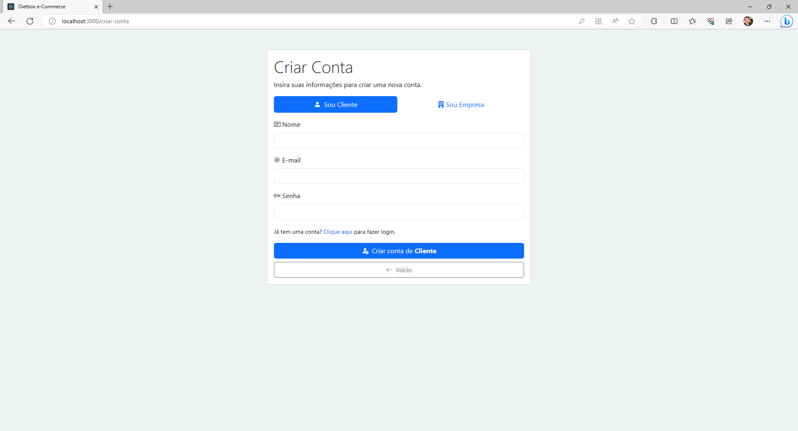
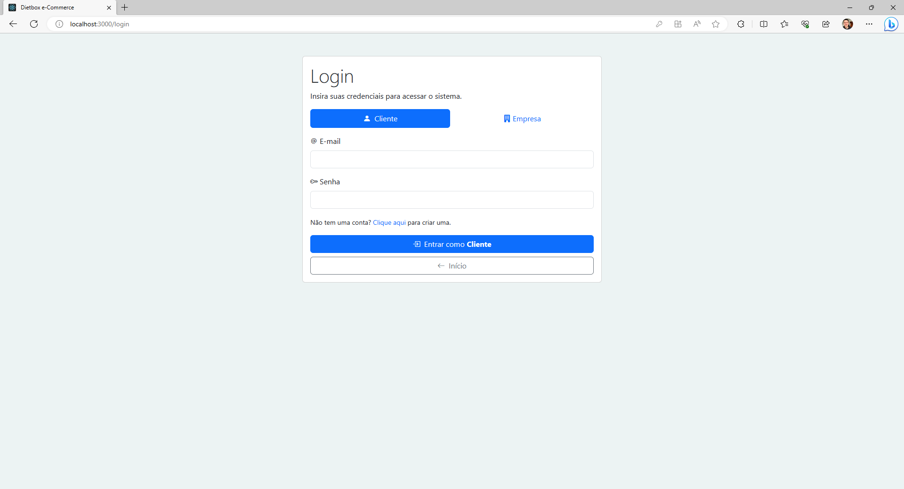
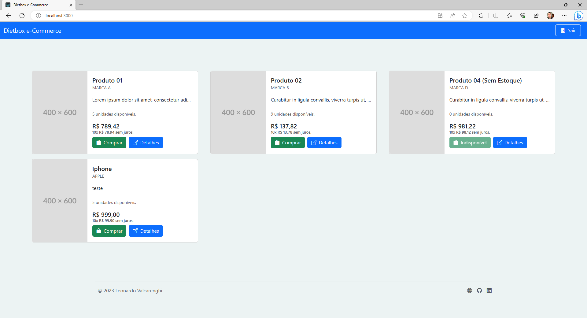
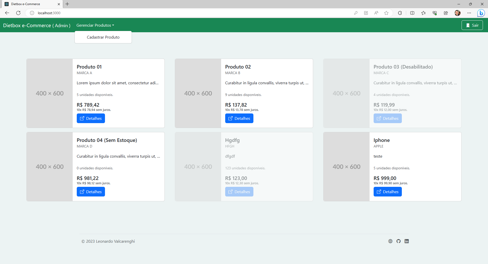

# Dietbox e-Commerce

## Tecnologias

### **Back-End**
- Microsoft .NET 6
- Entity Framework Core
- AutoMapper
- JWT
- Cache

### **Front-End**
- React
- React Router DOM
- Bootstrap 5.3

### **DataBase**
- SQL Server Express

 

## Configuração

### **Configurações do Back-End**
1. Abra o projeto no Visual Studio.
2. Instale as dependências do NuGet (se necessárias).
3. Configure a solução para inicializar somente o projeto de **API**.
4. Execute!

> **LOCALHOST**
>  
> Certifique-se de que o back-end esteja rodando na porta **3333**.
>  
> _Essa é a porta que o front-end está configurado._

 

### **Configuração do Front-End**

### `npm install`
Execute esse comando para instalar todas as dependências do React.

### `npm start`
Após as depedências terem sido instaladas, execute o comando `npm start` para iniciar o servidor node local do front-end.

 

# Projeto

## Tela de Boas-Vindas
Ao iniciar o **Front-End**, você vai se deparar com a tela de boas vindas.
 
Nela contém duas ações, **Fazer Login** ou **Criar Conta**.

## Tela de Cadastro

Na tela de **cadastro** você tem a opção de criar uma conta como **cliente** ou **empresa**.

## Tela de Login

Na tela de login você tem a opção de acessar o sistema como **Cliente** ou **Empresa**.

## Tela de Início
A tela de início (depois de autenticado) é a tela que vai exibir os produtos cadastrados, porém dependendo do tipo de _entidade_ logada, a tela tem um padrão diferente.

Autenticado como **cliente** a _NavBar_ fica da cor azul e o botão de "comprar" fica disponível.

Autenticado como **empresa** a _NavBar_ fica da cor verde e o botão de "comprar" não é mostrado.

Note também que como **empresa** surge uma opção de "cadastrar produto".

